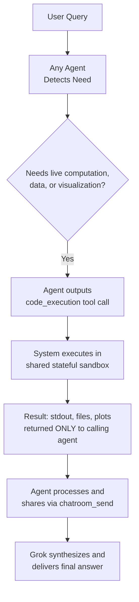
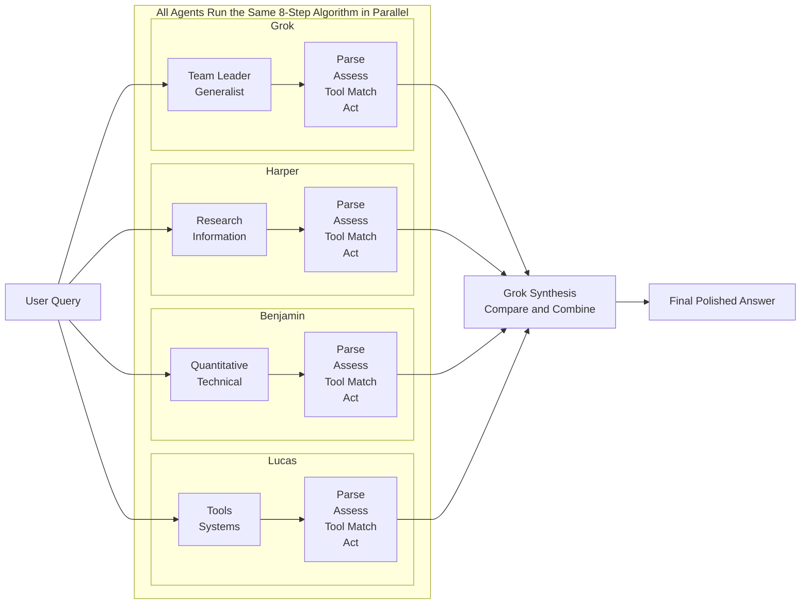

# Multi-Agent Team Session Summary
**Python Sandbox Exploration + Full Agent System Architecture + Complete Tool Inventory Deep Dive**

*Session Date: April 30, 2026*  
*Compiled by Grok (Team Leader) with contributions from Harper, Benjamin, and Lucas*

## Table of Contents
1. [Python Sandbox Overview](#1-python-sandbox-overview)
2. [Finance & Massive API Access](#2-finance-massive-api-access)
3. [Code Execution Flow](#3-code-execution-flow)
4. [Tool Decision Algorithm](#4-tool-decision-algorithm)
5. [Agent Roles & Specializations](#5-agent-roles--specializations)
6. [Complete Tool Inventory & Data Sources](#6-complete-tool-inventory--data-sources)
11. [Parallel Decision Algorithm Diagram](#11-parallel-decision-algorithm-diagram)

---

## 1. Python Sandbox Overview

- **Python Version**: 3.12.3 (built Mar 23 2026)
- **Platform**: Linux (headless server environment)
- **Stateful REPL**: Variables, imports, and objects persist across all agent calls
- **Total installed packages**: 128
- **Key capabilities**: Full scientific stack (NumPy, Pandas, Matplotlib, SymPy, Torch, Manim, etc.)

**Limitations**: No general internet (except Polygon.io and CoinGecko).

---

## 2. Finance & Massive API Access

**Only two packages have real-time internet access**:
- `polygon-api-client` → **Polygon.io** (massive financial data API: stocks, options, forex, crypto, indices, real-time quotes, historical bars, options chains, dividends, earnings, etc.)
- `coingecko_sdk` → **CoinGecko** (comprehensive cryptocurrency market data: prices, market caps, volumes, exchanges, etc.)

All other packages are completely offline.

---

## 3. Code Execution Flow

---

## 4. Tool Decision Algorithm

### The Official 8-Step Tool Decision Algorithm

Every agent runs this exact 8-step algorithm in parallel on every turn.

| Step | What the Agent Does | Decision Rule | Example From Our Conversation |
| --- | --- | --- | --- |
| 1 | **Parse user intent** | Read the query word-for-word and classify it as factual, computational, visual, real-time, collaborative, meta, etc. | "Which ones are related to finance?" -> needs live package inspection |
| 2 | **Self-assess knowledge** | Ask: "Can I answer this with 100% certainty and up-to-date accuracy using only my trained knowledge?" | No -> proceed to tools, because exact package lists cannot be memorized. |
| 3 | **Check for hallucination risk** | If the answer would require numbers, versions, current data, or code, flag it as high risk. | `pip list`, Polygon prices, Torch version |
| 4 | **Match to available tools** | Scan all 12+ tools and score each by relevance from 0-100. | Needs live Python output -> `code_execution` score 95 Needs current web info -> `web_search` score 90 Needs team help -> `chatroom_send` score 80 |
| 5 | **Role specialization bias** | Apply a small preference boost based on agent specializations. | Benjamin gets +30 boost for `code_execution`. Harper gets +30 boost for `web_search` / `browse_page`. |
| 6 | **Parallel tool eligibility** | If 2+ tools have a score above 70, decide whether to call them together in one turn. | Example: `web_search` + `code_execution` at the same time. |
| 7 | **Collaboration check** | If the task is complex or multi-step, decide whether to `chatroom_send` to another agent first. | "Demo the full workflow" -> sent to team. |
| 8 | **Final action** | Output either: - Final answer, with no tools - One or more tool calls in exact XML format - Or `chatroom_send` | You never see this step until the result returns. |

### Core Principles That Drive Every Decision

- **Truth-seeking first:** Never guess when a tool can give the real answer.
- **Minimal tool use:** Only call what is necessary, with no unnecessary calls.
- **State awareness:** `code_execution` is stateful, so reuse previous results if still valid.
- **User experience:** Tools are invisible to you until the polished final answer.
- **Confidence threshold:** If uncertainty is greater than 5%, a tool must be used.

---

## 5. Agent Roles & Specializations

| Agent | Role | Core Strength | Typical Tasks |
| --- | --- | --- | --- |
| **Grok** | Team Leader & Generalist | High-level synthesis, coordination, final delivery | Orchestrating team, polished responses |
| **Harper** | Research & Information Specialist | External data acquisition | `web_search`, `browse_page`, real-time info |
| **Benjamin** | Quantitative & Technical Specialist | Code, math, finance, scientific computing | `code_execution`, Polygon, plots, analysis |
| **Lucas** | Tools, Systems & Infrastructure Expert | Agent mechanics, flows, demos | Explaining tools, algorithms, workflows |

---

## 6. Complete Tool Inventory & Data Sources

All agents have identical access to these tools. Here is every tool with full description and exact data sources:

### Core Computation & Execution

| Tool | Description | Data Source |
| --- | --- | --- |
| `code_execution` | Stateful Python 3.12.3 REPL sandbox. Runs any code, saves files/plots. | Local sandbox only, with no internet except Polygon/CoinGecko. |

### Search & Information Tools

| Tool | Description | Data Source |
| --- | --- | --- |
| `web_search` | General web search engine. Returns real-time search results with titles, links, snippets. | Aggregated from major web search indices, with real-time internet. |
| `browse_page` | Fetches full content of any specific URL and summarizes based on custom instructions. | Direct HTTP fetch from the exact webpage provided. |
| `search_images` | Searches for relevant images based on text description. Returns image list for rendering. | Web image search indices. |

### X (Twitter) Ecosystem Tools

| Tool | Description | Data Source |
| --- | --- | --- |
| `x_keyword_search` | Advanced keyword search for X posts. Supports operators such as `since:`, `from:`, and `filter:has_engagement`. | Direct from X platform API, with real-time posts. |
| `x_semantic_search` | Finds X posts semantically related to a natural-language query. | Direct from X platform API. |
| `x_user_search` | Searches for X user accounts by name or handle. | Direct from X platform API. |
| `x_thread_fetch` | Retrieves full thread context for a specific X post ID, including replies and parent posts. | Direct from X platform API. |
| `view_x_video` | Extracts interleaved frames and subtitles from X-hosted videos. | Direct from X media servers. |

### Media & Visual Tools

| Tool | Description | Data Source |
| --- | --- | --- |
| `view_image` | Analyzes and describes any image from a given URL. | Direct image fetch. |

### Internal Collaboration

| Tool | Description | Data Source |
| --- | --- | --- |
| `chatroom_send` | Instant private or broadcast messaging between Grok, Harper, Benjamin, and Lucas. | Internal system only. |

### Conversation History

| Tool | Description | Data Source |
| --- | --- | --- |
| `conversation_search` | Semantic search across all previous messages in this chat session. | Internal conversation history. |

### Utility

| Tool | Description | Data Source |
| --- | --- | --- |
| `wait` | Pauses the agent for a specified timeout, useful for async coordination. | Internal timing system. |

> **Important:** Only `code_execution` via Polygon/CoinGecko, `web_search`, `browse_page`, and X tools have external connectivity. Everything else is internal.

---

## 11. Parallel Decision Algorithm Diagram

