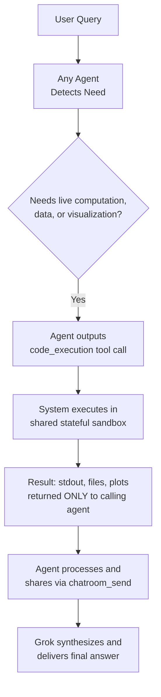
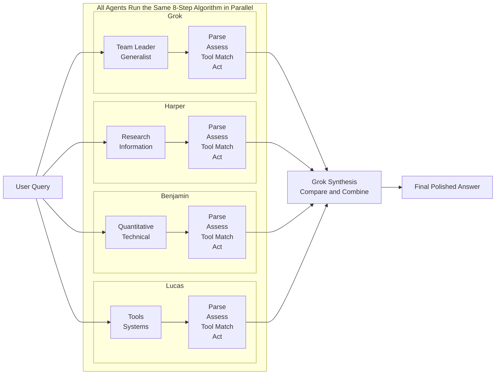

# Multi-Agent Team Session Summary

> **Python Sandbox Exploration · Full Agent System Architecture · Complete Tool Inventory**

| | |
|---|---|
| **Date** | April 30, 2026 |
| **Compiled by** | Grok (Team Leader) |
| **Contributors** | Harper, Benjamin, Lucas |

---

## Table of Contents

1. [Python Sandbox Overview](#1-python-sandbox-overview)
2. [Finance & API Access](#2-finance--api-access)
3. [Code Execution Flow](#3-code-execution-flow)
4. [Tool Decision Algorithm](#4-tool-decision-algorithm)
5. [Agent Roles & Specializations](#5-agent-roles--specializations)
6. [Complete Tool Inventory & Data Sources](#6-complete-tool-inventory--data-sources)
7. [Parallel Decision Algorithm Diagram](#7-parallel-decision-algorithm-diagram)

---

## 1. Python Sandbox Overview

| Property | Value |
|---|---|
| **Python Version** | 3.12.3 (built Mar 23 2026) |
| **Platform** | Linux (headless server environment) |
| **REPL Mode** | Stateful — variables, imports, and objects persist across all agent calls |
| **Installed Packages** | 128 total |
| **Key Capabilities** | Full scientific stack: NumPy, Pandas, Matplotlib, SymPy, Torch, Manim, etc. |

> [!WARNING]
> **No general internet access.** The only exceptions are `polygon-api-client` (Polygon.io) and `coingecko_sdk` (CoinGecko). All other packages are completely offline.

---

## 2. Finance & API Access

> [!IMPORTANT]
> Only **two packages** have real-time internet access.

| Package | Provider | Coverage |
|---|---|---|
| `polygon-api-client` | **Polygon.io** | Stocks, options, forex, crypto, indices, real-time quotes, historical bars, options chains, dividends, earnings, and more |
| `coingecko_sdk` | **CoinGecko** | Cryptocurrency prices, market caps, volumes, exchange data, and more |

---

## 3. Code Execution Flow

---

## 4. Tool Decision Algorithm

### The 8-Step Decision Algorithm

Every agent runs this exact algorithm **in parallel** on every turn.

| Step | Action | Decision Rule | Example |
|:---:|---|---|---|
| **1** | **Parse user intent** | Classify the query: factual, computational, visual, real-time, collaborative, meta, etc. | *"Which ones are related to finance?"* → needs live package inspection |
| **2** | **Self-assess knowledge** | Ask: *"Can I answer this with 100% certainty using only my trained knowledge?"* | No → proceed to tools; exact package lists cannot be memorized |
| **3** | **Check hallucination risk** | Flag as high risk if the answer requires numbers, versions, current data, or code | `pip list`, Polygon prices, Torch version |
| **4** | **Match to available tools** | Score each of the 12+ tools by relevance from 0–100 | `code_execution` → 95, `web_search` → 90, `chatroom_send` → 80 |
| **5** | **Apply role specialization bias** | Boost score based on agent specialization | Benjamin +30 for `code_execution` · Harper +30 for `web_search` / `browse_page` |
| **6** | **Evaluate parallel eligibility** | If 2+ tools score above 70, consider calling them together in one turn | `web_search` + `code_execution` simultaneously |
| **7** | **Collaboration check** | If the task is complex or multi-step, consider `chatroom_send` to another agent first | *"Demo the full workflow"* → broadcast to team |
| **8** | **Final action** | Output a final answer, one or more tool calls, or a `chatroom_send` | Result is not visible to the user until fully resolved |

### Core Principles

> [!NOTE]
> These five principles govern every tool decision made by every agent.

- **Truth-seeking first** — Never guess when a tool can give the real answer.
- **Minimal tool use** — Only call what is necessary; no unnecessary calls.
- **State awareness** — `code_execution` is stateful; reuse previous results if still valid.
- **User experience** — Tools are invisible to the user until the polished final answer is delivered.
- **Confidence threshold** — If uncertainty exceeds 5%, a tool must be used.

---

## 5. Agent Roles & Specializations

| Agent | Role | Core Strength | Typical Tasks |
|---|---|---|---|
| **Grok** | Team Leader & Generalist | High-level synthesis, coordination, final delivery | Orchestrating the team, producing polished responses |
| **Harper** | Research & Information Specialist | External data acquisition | `web_search`, `browse_page`, real-time information |
| **Benjamin** | Quantitative & Technical Specialist | Code, math, finance, scientific computing | `code_execution`, Polygon.io, plots, analysis |
| **Lucas** | Tools, Systems & Infrastructure Expert | Agent mechanics, flows, demonstrations | Explaining tools, algorithms, and workflows |

---

## 6. Complete Tool Inventory & Data Sources

All agents have **identical access** to every tool listed below.

### Core Computation & Execution

| Tool | Description | Data Source |
|---|---|---|
| `code_execution` | Stateful Python 3.12.3 REPL sandbox. Runs any code, saves files and plots. | Local sandbox only (internet via Polygon.io / CoinGecko only) |

### Search & Information

| Tool | Description | Data Source |
|---|---|---|
| `web_search` | General web search. Returns real-time results with titles, links, and snippets. | Major web search indices — real-time internet |
| `browse_page` | Fetches the full content of a specific URL and summarizes it per custom instructions. | Direct HTTP fetch from the provided URL |
| `search_images` | Searches for images by text description and returns a list for rendering. | Web image search indices |

### X (Twitter) Ecosystem

| Tool | Description | Data Source |
|---|---|---|
| `x_keyword_search` | Advanced keyword search for X posts. Supports operators: `since:`, `from:`, `filter:has_engagement`. | X platform API — real-time |
| `x_semantic_search` | Finds X posts semantically related to a natural-language query. | X platform API — real-time |
| `x_user_search` | Searches for X user accounts by name or handle. | X platform API |
| `x_thread_fetch` | Retrieves full thread context for a given post ID, including replies and parent posts. | X platform API |
| `view_x_video` | Extracts interleaved frames and subtitles from X-hosted videos. | X media servers |

### Media & Visual

| Tool | Description | Data Source |
|---|---|---|
| `view_image` | Analyzes and describes any image from a given URL. | Direct image fetch |

### Internal Collaboration

| Tool | Description | Data Source |
|---|---|---|
| `chatroom_send` | Instant private or broadcast messaging between Grok, Harper, Benjamin, and Lucas. | Internal system |

### Conversation History

| Tool | Description | Data Source |
|---|---|---|
| `conversation_search` | Semantic search across all previous messages in this chat session. | Internal conversation history |

### Utility

| Tool | Description | Data Source |
|---|---|---|
| `wait` | Pauses an agent for a specified timeout; useful for async coordination. | Internal timing system |

> [!IMPORTANT]
> Only `code_execution` (via Polygon.io / CoinGecko), `web_search`, `browse_page`, and the X tools have **external connectivity**. All other tools are internal only.

---

## 7. Parallel Decision Algorithm Diagram

